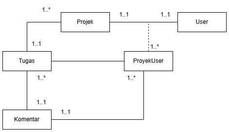
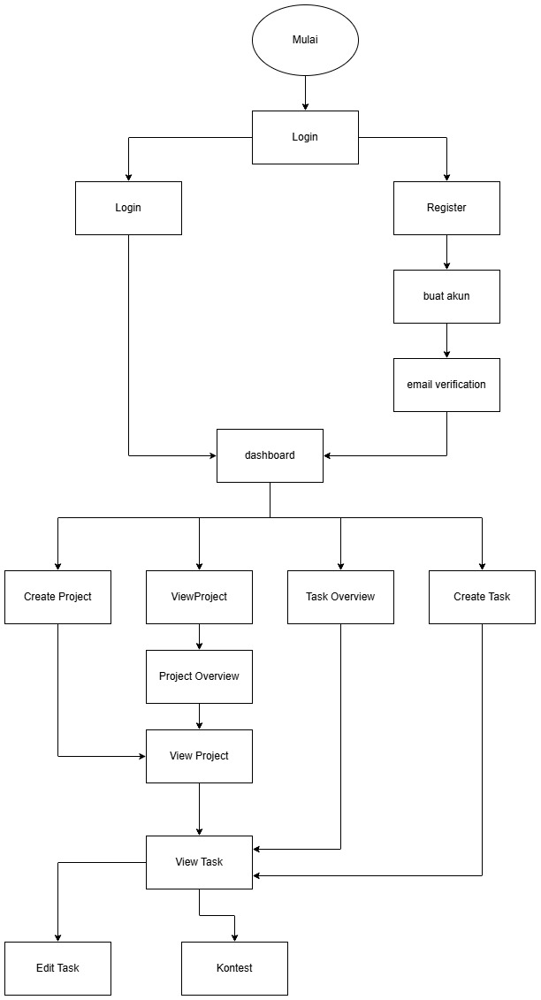

<div align="center">

  # TeamBurnOut
</div>

<div>
  
</div>

<div>
  
</div>

<p align="center">Aplikasi manajemen proyek modern yang dibangun dengan Laravel dan React, dirancang untuk membantu tim berkolaborasi secara efisien melalui manajemen tugas intuitif dan komunikasi real-time.</p>

## ✨ Fitur

### 📊 Manajemen Proyek

- Buat dan kelola banyak proyek
- Lacak kemajuan dan status penyelesaian proyek
- Undang anggota tim dengan izin berbasis peran (Manajer Proyek, Anggota Proyek)
- Statistik dan analitik proyek real-time
- Pelacakan status proyek (Tertunda, Dalam Proses, Selesai)

### ✅ Manajemen Tugas

- Buat, tetapkan, dan lacak tugas dalam proyek
- Kategorisasi tugas dengan label yang dapat disesuaikan
- Prioritas tugas (Rendah, Sedang, Tinggi)
- Pelacakan status tugas (Tertunda, Dalam Proses, Selesai)
- Diskusi tugas dengan komentar berulir
- Penyaringan dan pengurutan tugas

### 👥 Kolaborasi Tim

- Kontrol akses berbasis peran
- Sistem undangan anggota proyek
- Notifikasi real-time untuk pembaruan proyek
- Penugasan dan penugasan ulang tugas
- Manajemen anggota tim
- Diskusi tugas kolaboratif

### 🎨 Antarmuka Pengguna

- Desain modern dan responsif
- Dukungan tema Gelap/Terang
- Navigasi intuitif
- Pembaruan real-time
- Dasbor dengan ikhtisar proyek dan tugas
- Kemampuan penyaringan dan pengurutan

### 🔐 Autentikasi

- Autentikasi email/kata sandi tradisional
- Dukungan login sosial:
  - Autentikasi GitHub
  - Autentikasi Google
- Fungsi reset kata sandi
- Verifikasi email

## 🛠️ Teknologi yang Digunakan

### 🔧 Backend

- PHP 8.x
- Laravel 11.x
- MySQL
- Laravel Sanctum untuk autentikasi
- Spatie Permissions untuk manajemen peran
- Notifikasi real-time dengan Laravel Reverb

### 🎯 Frontend

- React dengan TypeScript
- Inertia.js untuk pengalaman seperti SPA
- TailwindCSS untuk styling
- Komponen UI Shadcn
- Ikon Lucide
- Pembaruan real-time dengan WebSockets

## 📥 Instalasi

1. Clone repositori

```bash
git clone https://github.com/RidoGustiIllahi/Tubes-Pemweb-Lanjut
```

2. Install PHP dependencies

```bash
composer install
```

3. Install JavaScript dependencies

```bash
npm install
```

4. Configure environment variables

```bash
cp .env.example .env
```

Perbaharui hal berikut di file .env Anda:

- Database credential

5. Generate application key

```bash
php artisan key:generate
```

6. Jalankan migrations dan seeders

```bash
php artisan migrate --seed
```

7. Hubungkan dengan storage

```bash
php artisan storage:link
```

## 👤 Default Credentials

Setelah seeding database, Anda dapat login dengan:

- Email: admin@example.com
- Password: password1

## 💻 Development

Untuk pengembahan dalam local:

1. Start the Laravel development server

```bash
php artisan serve
```

2. Run Vite development server

```bash
npm run dev
```

3. Run WebSocket server (for real-time features)

```bash
php artisan reverb:start
```

4. Run the Laravel queue worker

```bash
php artisan queue:listen
```
